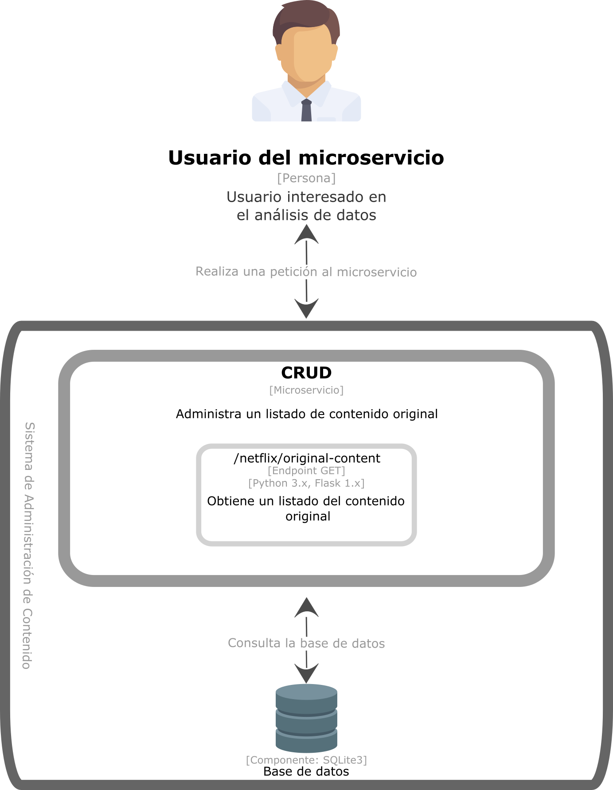

# Arquitecturas - Microservicios

## Microservicio de Administración de Contenido (MAC)

En la siguiente figura se muestra el diseño del microservicio actual:


## Prerrequisitos
- Clonar el repositorio:
   ```shell
   $ git clone https://gitlab.com/tareas-arquitectura-de-software-curso/microservicios-2.git
   $ cd microservicios-2
   ```

- Contar con python 3.6 o superior (las pruebas fueron realizadas con la versión 3.6.10). Se recomienda utilizar [pyenv](https://github.com/pyenv/pyenv) como manejador de versiones de python; una vez instalado se pueden seguir los siguientes comandos para instalar la versión deseada de python, esto hay que realizarlo en la raíz del repositorio:
   ```shell
   $ pyenv install 3.6.10
   $ pyenv local 3.6.10
   ```

- Crear un ambiente virtual para manejar las dependencias ejecutando:
   ```shell
   $ python3 -m venv venv
   ```

   o en Windows:
   ```shell
   $ py -3 -m venv venv
   ```

   Esto creará una carpeta llamada "venv" que representa nuestro ambiente virtual y donde instalaremos todas las dependencias.

- Activamos el ambiente virtual:
   ```shell
   $ source venv/bin/activate
   ```

   o en Windows:
   ```shell
   $ venv\Scripts\activate
   ```

- Instalamos las dependencias del sistema ejecutando:
   ```shell
   (venv)$ pip3 install -r requirements.txt 
   ```

   Los paquetes que se instalarán son los siguientes:

   Paquete | Versión | Descripción
   --------|---------|------------
   Flask   | 1.1.1   | Micro framework de desarrollo

   *__Nota__: También puedes instalar estos prerrequisitos manualmente ejecutando los siguientes comandos:*   
   > pip3 install Flask==1.1.1

## Ejecución

Una vez instalados los prerrequisitos es momento de ejecutar el sistema siguiendo los siguientes pasos:
1. Definimos el ambiente de Flask como desarrollo:
   ```shell
   (venv)$ export FLASK_ENV=development
   ```

1. Ejecutamos el microservicio:
   ```shell
   (venv)$ python3 mac/__init__.py
   ```
   
   Si la ejecución fue correcta debe de aparecer lo siguiente:
   ```shell
   * Serving Flask app "__init__" (lazy loading)
   * Environment: development
   * Debug mode: on
   * Running on http://0.0.0.0:8084/ (Press CTRL+C to quit)
   * Restarting with stat
   * Debugger is active!
   * Debugger PIN: 285-092-272
   ```

## Pruebas
Para probar los endpoints se pueden realizar a través de un navegador web, una terminal o algún software como [Postman](https://www.postman.com/).

1. Probando con una terminal:
   ```shell
   $ curl -X GET localhost:8084/netflix/original-content
   ```

   Respuesta:
   ```shell
   $ [{"id": 1, "name": "house of cards", "type": "series", "genre": "drama", "imdb_rating": null}, {"id": 2, "name": "stranger things", "type": "series", "genre": "drama", "imdb_rating": null}]
   ```


## Versión

2.0.0 - Marzo 2020

## Autores

* **Perla Velasco**
* **Yonathan Martínez**
* **Sergio Salazar**
